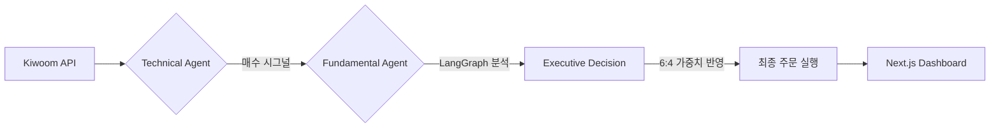

# 📈 SolT: Solar Trading Agent
> **UPSTAGE Agentic Workflow 2-Week Project** | **금융 2팀**
> Upstage Solar LLM 기반 하이브리드 주식 자동매매 에이전트

---

## 💡 핵심 컨셉 (Core Logic)
SolT는 기술적 지표(Task 1)와 기본적 분석(Task 2)을 결합하여 최종 매매를 결정합니다.

$$Final \ Score = (Technical \times 0.6) + (Fundamental \times 0.4)$$

1.  **Task 1 (Technical):** 3분봉 돌파 전략 기반 실시간 타겟 필터링 (PyQt6)
2.  **Task 2 (Fundamental):** 뉴스·재무·리포트 통합 감성 및 퀀트 분석 (LangGraph)
3.  **Decision:** 두 점수를 가중 합산하여 최종 BUY/HOLD/SELL 실행

---

## 🏗 시스템 구조 (Simple Architecture)




---

## 🛠 기술 스택 (Tech Stack)

* **AI/Agent:** Upstage Solar LLM, LangGraph, LangChain
* **Trading:** Python 3.12, PyQt6, Kiwoom OpenAPI
* **Database:** PostgreSQL, Qdrant (Vector DB)
* **Frontend:** Next.js, Tailwind CSS

---

## 🚀 빠른 시작 (Quick Start)

### 1. 환경 설정

`.env` 파일에 API 키(UPSTAGE, KIWOOM, DART 등)를 설정합니다.

### 2. DB 초기화 (Task 2 전용)

```bash
python task2/run_db_init.py

```

### 3. 실행

```bash
# 트레이딩 엔진 및 UI 실행
python main.py

# (선택) API 서버 및 대시보드
uv run uvicorn server:app
npm run dev

```

---

## 📂 주요 모듈

* `/src/agents`: 기술적/기본적 분석 에이전트 로직
* `/task2`: LangGraph 기반 데이터 수집 및 판단 파이프라인
* `/dashboard`: Next.js 모니터링 대시보드
* `/src/core/kiwoom.py`: 우선순위 큐 기반 API 브로커

---

*본 프로젝트는 UPSTAGE Agentic Workflow 교육 과정의 결과물입니다.*
